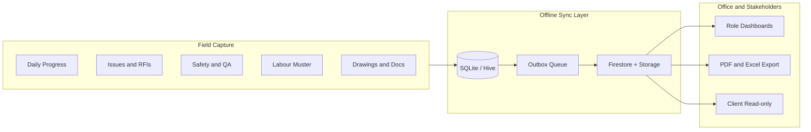
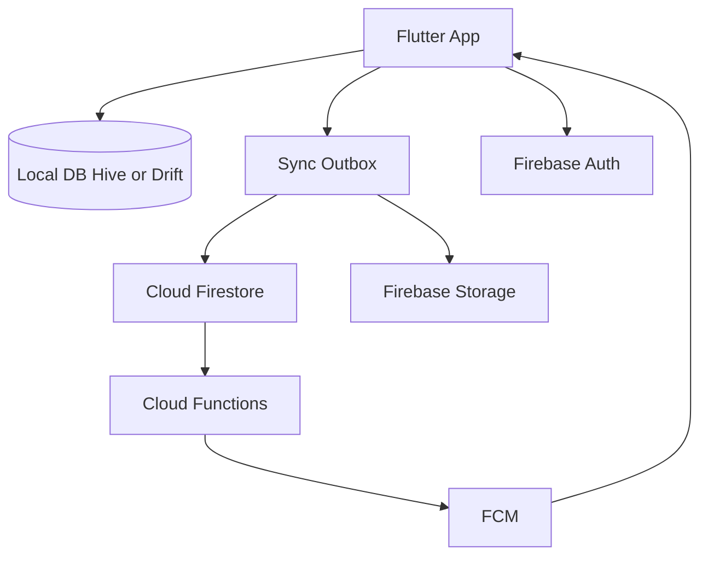

# Construction Field App — Holistic Build Plan

## Product positioning

**Win now:** India / emerging-market mid-size GCs and specialty contractors who today run sites on WhatsApp, paper registers, and Excel.

**Win later:** Enterprise-ready hooks (org hierarchy, API/export, Autodesk Forge WebView, audit trails) so the same product can grow into Procore-adjacent workflows without a rewrite.

**Market context (why this works):**
- Jobsite management software is growing ~12–17% CAGR globally; Asia-Pacific and India are among the fastest adopters.
- Mid-market is underserved: Procore/ACC are heavy and costly; Fieldwire/Raken win on field UX but are Western-priced and weak on Indian DPR/muster/WhatsApp realities.
- Field apps fail when they are desk-first, online-only, or too form-heavy. Adoption wins on **offline**, **low-end Android**, **&lt;5 minute daily capture**, and **evidence (photo + GPS)**.

**Differentiation thesis:** Be the **field evidence OS** — every day on site produces structured, syncable proof (progress, issues, safety, labour, materials) that replaces WhatsApp noise and feeds owners/PMs without forcing crews into enterprise bureaucracy.

---

## Scope: requirements + market additions

### Phase 0 — Foundations (weeks 1–3)
From RAYNS brief + non-negotiables for field adoption.

| Area | Deliverable |
|------|-------------|
| Stack | Flutter (Android primary, iOS parity), Firebase Auth, Firestore, Storage, Cloud Functions, FCM |
| Offline | Offline-first with local cache, outbox queue, conflict policy, sync logs, storage cleanup |
| Auth / RBAC | Email/phone + biometric unlock; roles: Site Engineer, PM, QA/QC, Client (read-only), Admin |
| Project model | Org → Project → Members; multi-site switcher |
| NFRs | Launch &lt;2s warm path; image compression; encrypted local prefs; HTTPS only |
| Device bar | Target mid/low-end Android (API 24+); large tap targets; sunlight-readable contrast |

**Default conflict policy:** last-write-wins on scalar fields; append-only for comments/photos; status changes audited.

### Phase 1 — RAYNS MVP (weeks 4–12)
Exact brief, production-quality.

1. **Authentication & access** — OAuth2-equivalent via Firebase Auth; biometric local unlock; permission matrix (CRUD by role); role dashboards.
2. **Issues & RFIs** — create/edit/assign/track; photo/video + GPS + comments; status `Open → In Progress → Resolved → Closed`; threaded RFI comments; offline create + background sync; push on assign/status.
3. **Documents** — hierarchy `Project → Discipline → Document Type → Files`; upload/download; in-app PDF/TXT/CSV viewer with zoom/search/page nav (defer print if heavy; offer system share/print).
4. **Admin** — invite users, assign roles/projects, basic org settings.
5. **Deliverables** — Android + iOS builds, API/config notes, short training PDF.

### Phase 2 — Market differentiators that move the industry (weeks 10–18, overlap OK)
These are **beyond the RAYNS PDF** and are where mid-market ROI is proven by competitors (Raken, Fieldwire, Trackovo, Site Setu) and by India site reality.

| Module | Why it matters | Ship shape |
|--------|----------------|------------|
| **Daily Progress Report (DPR)** | Replaces evening WhatsApp/Excel; legal/owner evidence | Template DPR: weather, manpower summary, activities + photos, blockers; 1-tap PDF share |
| **Drawing-linked punch / snags** | Fieldwire’s killer feature; RFIs alone are not enough | Pin issues to drawing pages/coords; markup lite (pin + cloud); versioned drawings |
| **Safety & toolbox talks** | Compliance + Procore/Raken table stakes | Checklists, observations, incident log, photo evidence, daily rollup into DPR |
| **QA/QC inspections** | QA role in brief needs real work product | Configurable checklists (WIR-style), pass/fail, photo mandatory on fail |
| **Labour muster (supervisor-led)** | India wage/proxy pain; not full biometric payroll | Geofenced supervisor check-in + headcount by trade/subcontractor; photo optional |
| **Material inward / consumption (lite)** | Stops “where did cement go” disputes | Simple GRN-style log + consumption against activity; no full inventory ERP |
| **Voice / WhatsApp-adjacent capture** | Adoption: one-handed site use | Voice note → transcript field on DPR/issue; share summary link/PDF to WhatsApp |
| **Smart reminders & digests** | Missed DPRs kill trust | 5 PM DPR nudge; PM digest of open blockers/RFIs |

**Deliberately defer (Phase 3+ enterprise hooks, not MVP):** full BIM/digital twin, submittals/cost codes/job costing, facial payroll AI, drone/360 reality capture, Tally/ERP deep sync, multi-language pack (design for i18n from day one; Hindi pack later).

### Phase 3 — Enterprise readiness (post-MVP, ~weeks 18–28)
Keep architecture ready; implement when traction exists.

- WebView shell for Autodesk Forge / Unity WebGL / photogrammetry (already in RAYNS “future”).
- Audit log export, SSO (Google Workspace / Microsoft), open REST export for owners/lenders.
- Submittals + basic change-order notes.
- AI assist (optional): auto-tag issue photos, draft RFI text, risk flags on overdue punches — inspired by Procore Helix / Autodesk Construction IQ, but as add-ons not blockers.
- Admin web console (Flutter web or simple Firebase-hosted admin) for document bulk upload.

---

## Recommended technical architecture

**Chosen stack (your 2A):** Flutter + Firebase — fastest path to offline + push + auth, matches ~16–20 week RAYNS timeline for core, with Phase 2 extending to ~22–26 weeks for a market-ready product.

**Key packages (indicative):** `firebase_core`, `firebase_auth`, `cloud_firestore`, `firebase_storage`, `firebase_messaging`, `local_auth`, `geolocator`, `image_picker` + compression, `pdfrx`/`syncfusion_flutter_pdfviewer`, `connectivity_plus`, `workmanager` / background sync, Drift or Hive for offline mirror if Firestore persistence alone is insufficient for large drawing caches.

**Data model (core collections):**
- `organizations`, `projects`, `memberships`
- `issues`, `rfis`, `comments`
- `folders`, `documents` (+ `drawing_pins` in Phase 2)
- `dprs`, `safety_records`, `inspections`, `attendance_logs`, `material_logs`
- `sync_events` / client outbox metadata
- Storage paths: `org/{id}/project/{id}/...`

**Security:** Firestore rules by `memberships` role; Storage rules mirror project membership; no public buckets; FieldValue server timestamps; soft-delete + audit where status changes matter.

**Repo bootstrap (greenfield today):** only [Construction Management Field App.pdf](Construction%20Management%20Field%20App.pdf) / `.pptx` exist — create Flutter monorepo (`apps/mobile`, optional `apps/admin`, `firebase/`).

---

## UX principles (field adoption)

- One-thumb primary actions: **New Issue**, **Today’s DPR**, **Pin on Drawing**.
- Offline badge always visible; never block create on no network.
- Minimal required fields; photos encouraged, not 20-field forms.
- Role home screens: Engineer = capture; PM = queue + approve; QA = inspections; Client = progress + docs read-only.
- Hinglish-friendly copy; prepare ARB i18n from sprint 1.

---

## Delivery plan

| Phase | Weeks | Outcome |
|-------|-------|---------|
| Discovery lock + UX | 1–3 | Clickable Figma for MVP + DPR/safety wireframes; Firebase project; CI |
| MVP build | 4–12 | Auth, issues/RFIs, docs, offline sync, roles, FCM |
| Differentiator build | 10–18 | DPR, drawing pins, safety/QA checklists, labour lite, material lite, PDF share |
| Harden + UAT | 18–22 | Low-end device test, sync conflict drills, pilot on 1–2 live sites |
| Launch + support | 22–26 | Play Store / TestFlight, training, 3-month hypercare |

**Pilot success metrics:** ≥70% of site engineers submit DPR ≥4 days/week; issue create median &lt;90s; sync failure rate &lt;2%; client can open weekly PDF without PM manual compile.

---

## Risks and mitigations

| Risk | Mitigation |
|------|------------|
| Firebase cost at scale | Composite indexes, photo compression, Storage lifecycle, usage dashboards from day 1 |
| Low-end device lag | Aggressive image resize, lazy lists, drawing tile cache, avoid huge offline blobs |
| Field non-adoption | DPR in 3 minutes; WhatsApp PDF share; voice notes; supervisor-led labour not worker app mandate |
| Scope creep to Procore | Freeze Phase 3 behind pilot metrics; enterprise = hooks only until paid demand |
| Built-in viewer effort | Ship solid PDF viewer first; system share for exotic formats |

---

## What we will implement when you approve execution

1. Scaffold Flutter app + Firebase (Auth, Firestore, Storage, Functions, FCM) and folder architecture (features / data / sync).
2. Implement Phase 1 MVP against RAYNS modules with offline outbox.
3. Immediately design Phase 2 modules into the data model (DPR, pins, safety) so we do not paint ourselves into a corner.
4. Add README, env/config, and a phased backlog matching this plan.

No native-only Android path; iOS ships from the same Flutter codebase. Enterprise BIM/Forge remains a WebView module after MVP.