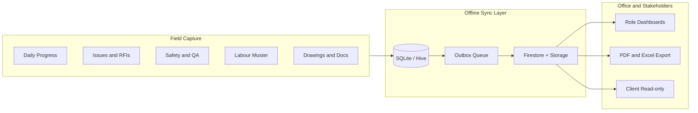
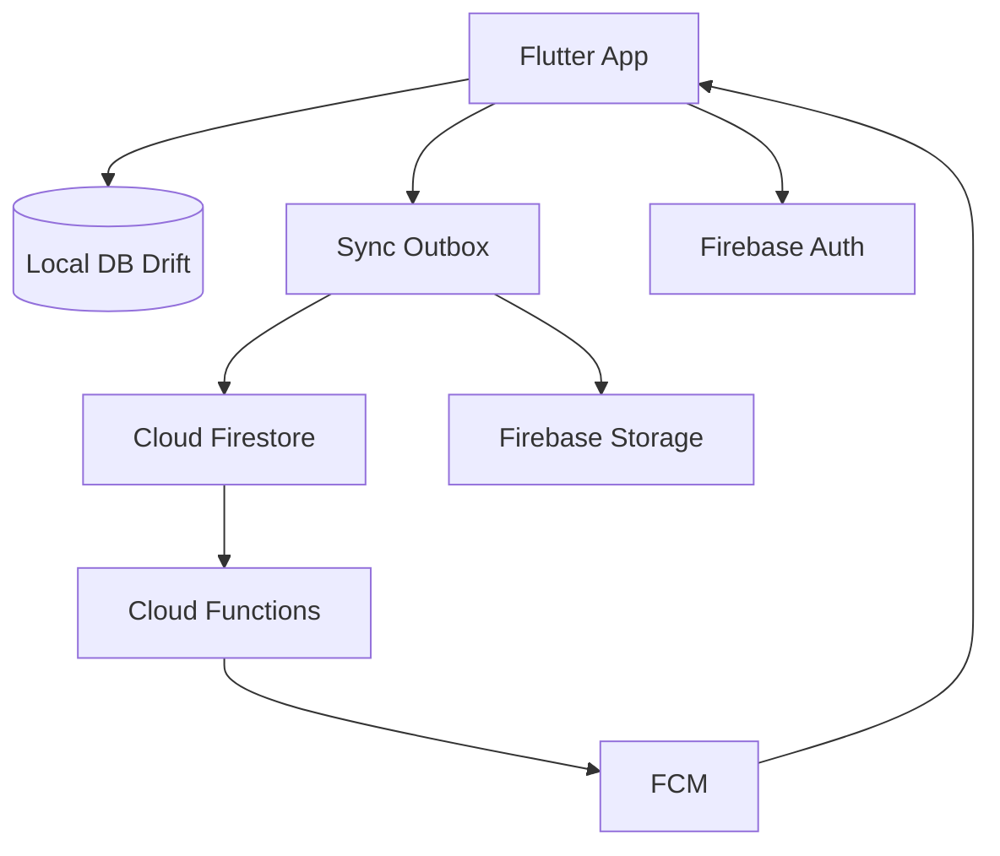

# Construction Field App — Holistic Build Plan

> **Canonical copy:** this file under `docs/`. The Cursor plan at `.cursor/plans/construction_field_app_54df27ca.plan.md` should mirror it.

## Product positioning

**Win now:** India / emerging-market mid-size GCs and specialty contractors who today run sites on WhatsApp, paper registers, and Excel.

**Win later:** Enterprise-ready hooks (org hierarchy, API/export, Autodesk Forge WebView, audit trails) so the same product can grow into Procore-adjacent workflows without a rewrite.

**Market context (why this works):**
- Jobsite management software is growing ~12–17% CAGR globally; Asia-Pacific and India are among the fastest adopters.
- Mid-market is underserved: Procore/ACC are heavy and costly; Fieldwire/Raken win on field UX but are Western-priced and weak on Indian DPR/muster/WhatsApp realities.
- Field apps fail when they are desk-first, online-only, or too form-heavy. Adoption wins on **offline**, **low-end Android**, **&lt;5 minute daily capture**, and **evidence (photo + GPS)**.

**Differentiation thesis:** Be the **field evidence OS** — every day on site produces structured, syncable proof (progress, issues, safety, labour, materials) that replaces WhatsApp noise and feeds owners/PMs without forcing crews into enterprise bureaucracy.



---

## Scope: requirements + market additions

### Phase 0 — Foundations
From RAYNS brief + non-negotiables for field adoption.

| Area | Deliverable |
|------|-------------|
| Stack | Flutter (Android primary, iOS parity), Firebase Auth, Firestore, Storage, Cloud Functions, FCM |
| Offline | Offline-first with local cache, outbox queue, conflict policy, sync logs, storage cleanup |
| Auth / RBAC | Email/phone + biometric unlock; roles: Site Engineer, PM, QA/QC, Client (read-only), Admin |
| Project model | Org → Project → Members; multi-site switcher |
| NFRs | Launch &lt;2s warm path; image compression; encrypted local prefs; HTTPS only |
| Device bar | Target mid/low-end Android (API 24+); large tap targets; sunlight-readable contrast |
| Tooling locks | State: Riverpod; local DB: Drift (+ Firestore persistence); CI: GitHub Actions; crash/analytics: Firebase Crashlytics + Analytics; i18n: ARB from sprint 1 |
| Admin path (MVP) | Mobile admin for invite/roles/projects; web console deferred to Phase 3 |

**Default conflict policy:** last-write-wins on scalar fields; append-only for comments/photos; status changes audited.

**Hard risks to design for early:** membership-scoped Firestore/Storage rules; video + drawing cache on low-end Android; phone-auth/SMS cost in India; speech-to-text offline fallback for voice capture.

### Phase 1 — RAYNS MVP
Exact brief, production-quality. Freeze feature set before starting Phase 2a.

1. **Authentication & access** — Firebase Auth (email/password + phone where needed); biometric local unlock; permission matrix (CRUD by role); role dashboards.
2. **Issues & RFIs** — create/edit/assign/track; photo/video + GPS + comments; status `Open → In Progress → Resolved → Closed`; threaded RFI comments; offline create + background sync; push on assign/status.
3. **Documents** — hierarchy `Project → Discipline → Document Type → Files`; upload/download; in-app PDF/TXT/CSV viewer with zoom/search/page nav (defer print if heavy; offer system share/print).
4. **Admin** — invite users, assign roles/projects, basic org settings (in-app).
5. **Deliverables** — Android + iOS builds, API/config notes, short training PDF.

### Phase 2a — Must-ship differentiators (after MVP freeze)
Highest ROI for India mid-market; do not start until Phase 1 is feature-complete and sync is stable.

| Module | Why it matters | Ship shape |
|--------|----------------|------------|
| **Daily Progress Report (DPR)** | Replaces evening WhatsApp/Excel; legal/owner evidence | Template DPR: weather, manpower summary, activities + photos, blockers; 1-tap PDF share |
| **Drawing-linked punch / snags** | Fieldwire’s killer feature; RFIs alone are not enough | Pin issues to drawing pages/coords; markup lite (pin + cloud); versioned drawings |

### Phase 2b — Post-pilot differentiators (gated on pilot metrics)
Ship only after pilot success metrics pass (or with paid demand). Keep collections in the data model so schema stays ready.

| Module | Why it matters | Ship shape |
|--------|----------------|------------|
| **Safety & toolbox talks** | Compliance + Procore/Raken table stakes | Checklists, observations, incident log, photo evidence, daily rollup into DPR |
| **QA/QC inspections** | QA role in brief needs real work product | Configurable checklists (WIR-style), pass/fail, photo mandatory on fail |
| **Labour muster (supervisor-led)** | India wage/proxy pain; not full biometric payroll | Geofenced supervisor check-in + headcount by trade/subcontractor; photo optional |
| **Material inward / consumption (lite)** | Stops “where did cement go” disputes | Simple GRN-style log + consumption against activity; no full inventory ERP |
| **Voice / WhatsApp-adjacent capture** | Adoption: one-handed site use | Voice note → transcript field on DPR/issue; share summary link/PDF to WhatsApp |
| **Smart reminders & digests** | Missed DPRs kill trust | 5 PM DPR nudge; PM digest of open blockers/RFIs |

**Deliberately defer (Phase 3+ enterprise hooks, not MVP):** full BIM/digital twin, submittals/cost codes/job costing, facial payroll AI, drone/360 reality capture, Tally/ERP deep sync, multi-language pack (design for i18n from day one; Hindi pack later).

### Phase 3 — Enterprise readiness (post-MVP)
Keep architecture ready; implement when traction exists.

- WebView shell for Autodesk Forge / Unity WebGL / photogrammetry (already in RAYNS “future”).
- Audit log export, SSO (Google Workspace / Microsoft), open REST export for owners/lenders.
- Submittals + basic change-order notes.
- AI assist (optional): auto-tag issue photos, draft RFI text, risk flags on overdue punches — inspired by Procore Helix / Autodesk Construction IQ, but as add-ons not blockers.
- Admin web console (Flutter web or simple Firebase-hosted admin) for document bulk upload.

---

## Recommended technical architecture

**Chosen stack:** Flutter + Firebase — fastest path to offline + push + auth for RAYNS core, then Phase 2a for a market-ready product.



**Key packages (indicative):** `flutter_riverpod`, `firebase_core`, `firebase_auth`, `cloud_firestore`, `firebase_storage`, `firebase_messaging`, `firebase_crashlytics`, `firebase_analytics`, `local_auth`, `geolocator`, `image_picker` + compression, `pdfrx`/`syncfusion_flutter_pdfviewer`, `connectivity_plus`, `workmanager` / background sync, `drift` for offline mirror + large drawing caches.

**Data model (core collections):**
- `organizations`, `projects`, `memberships`
- `issues`, `rfis`, `comments`
- `folders`, `documents` (+ `drawing_pins` in Phase 2a)
- `dprs` (Phase 2a); `safety_records`, `inspections`, `attendance_logs`, `material_logs` (Phase 2b schema-ready)
- `sync_events` / client outbox metadata
- Storage paths: `org/{id}/project/{id}/...`

**Security:** Firestore rules by `memberships` role; Storage rules mirror project membership; no public buckets; FieldValue server timestamps; soft-delete + audit where status changes matter.

**Repo layout:**
```
apps/mobile/          # Flutter app
firebase/             # rules, indexes, functions
docs/                 # plans and training
.github/workflows/    # CI
```

---

## UX principles (field adoption)

- One-thumb primary actions: **New Issue**, **Today’s DPR**, **Pin on Drawing**.
- Offline badge always visible; never block create on no network.
- Minimal required fields; photos encouraged, not 20-field forms.
- Role home screens: Engineer = capture; PM = queue + approve; QA = inspections; Client = progress + docs read-only.
- Hinglish-friendly copy; prepare ARB i18n from sprint 1.

---

## Delivery plan

| Phase | Outcome | Gate |
|-------|---------|------|
| Phase 0 Foundations | Flutter + Firebase scaffold, feature folders, CI, security rules skeleton, ARB i18n stub | Repo builds on CI |
| Phase 1 MVP | Auth, issues/RFIs, docs, offline sync, roles, FCM | Feature freeze; sync failure rate trending &lt;5% on device lab |
| Phase 2a | DPR + PDF share, drawing-linked punch pins | Phase 1 freeze complete |
| Harden + UAT | Low-end device test, sync conflict drills, pilot on 1–2 live sites | Pilot metrics met |
| Phase 2b | Safety/QA/labour/material/voice/digests | Pilot metrics or paid demand |
| Launch + support | Play Store / TestFlight, training, hypercare | Store review + training pack |
| Phase 3 | Enterprise hooks (Forge WebView, SSO, admin web) | Traction / enterprise deals |

**Pilot success metrics:** ≥70% of site engineers submit DPR ≥4 days/week; issue create median &lt;90s; sync failure rate &lt;2%; client can open weekly PDF without PM manual compile.

---

## Risks and mitigations

| Risk | Mitigation |
|------|------------|
| Firebase cost at scale | Composite indexes, photo compression, Storage lifecycle, usage dashboards from day 1 |
| Low-end device lag | Aggressive image resize, lazy lists, drawing tile cache, avoid huge offline blobs / prefer photo over video by default |
| Field non-adoption | DPR in 3 minutes; WhatsApp PDF share; voice notes (2b); supervisor-led labour not worker app mandate |
| Scope creep to Procore | Freeze Phase 1 before 2a; gate 2b on pilot metrics; enterprise = hooks only until paid demand |
| Built-in viewer effort | Ship solid PDF viewer first; system share for exotic formats |
| Membership security holes | Rules skeleton + emulator tests from Phase 0; no public buckets |
| Phone auth / SMS cost (India) | Prefer email + org invite codes for MVP; phone as optional later with budget caps |
| Voice transcript offline | Store audio offline; transcript when online (Phase 2b) |

---

## Execution status

1. ~~Plan + README~~ — done.
2. ~~Phase 0–1 MVP core~~ — done (auth, issues/RFIs, documents, offline sync).
3. ~~Phase 2a DPR + drawing pins~~ — done.
4. ~~Phase 2b site ops~~ — done: safety/toolbox + observations/incidents (photo rules), QA WIR checklists (photo-on-fail), supervisor labour muster, material inward/consumption lite.
5. ~~Firebase wiring prep~~ — packages + bootstrap gate + `FirebaseAuthRepository`; demo mode until `flutterfire configure`. See `docs/Firebase_Setup.md`.
6. ~~Voice + digests~~ — demo voice notes on DPR/issues; 5 PM DPR nudge prefs; PM digest of open issues/RFIs/blockers with WhatsApp copy.
...
20. ~~RFI FCM parity~~ — `onRfiWrite` assign/status pushes + client `assignRfi` / local notify intents (`rfi_assigned` / `rfi_status`).
21. ~~System share~~ — `share_plus` for DPR / PM digest / document summary (clipboard fallback); see core `SharePort`.
22. ~~Local DPR nudge~~ — `flutter_local_notifications` daily tray reminder from Digests prefs; Simulate posts tray + inbox. Cloud FCM cron still deferred.
23. ~~Notification deep links~~ — tray / FCM open / Sync inbox tap → DPR / issue / RFI; Digests hour picker for nudge.
24. ~~1-tap PDF export~~ — `package:pdf` + `SharePort.shareFile` for DPR and PM digest PDFs (text share remains available).
25. ~~Sync diagnostics + health~~ — Sync status shows `BackgroundSyncMeta`, device vs demo network, Probe → `health` callable (NoOp in demo).
26. ~~Evidence photo compression~~ — `EvidenceImagePolicy` + `FileImageCompressor` (max 1600px / ~400KB); gallery pick; `MediaAttachment.byteSizeBytes`.
27. ~~Pilot hub PDF~~ — `FieldPdfExport.pilot` + Share pilot PDF / text from Pilot hub hypercare snapshot.
28. **Next (operator):** `flutterfire configure` + seed + live UAT / store tracks. Drift and scheduled 5 PM nudge Function remain follow-ups.
7. ~~Pilot / UAT pack~~ — training guide, UAT checklist, hypercare metrics docs + in-app Pilot hub (checklist + live snapshot). Live-site execution and store tracks still need your Firebase project / devices.
8. ~~Admin invites~~ — in-app create invite + demo accept via FakeAuth (scoped memberships); Cloud Functions email later.
9. ~~Device sensors~~ — `geolocator` / `image_picker` / `local_auth` with Fake defaults; enable native via `--dart-define=USE_NATIVE_SENSORS=true`. See `docs/Device_Sensors.md`.
10. ~~Firebase go-live prep~~ — emulator seed (`firebase/seed`), `inviteMember` + `onDprWrite` Functions, membership indexes, rules for `invites`/`voice_notes`, [Go_Live_Checklist.md](Go_Live_Checklist.md).
11. ~~Firestore outbox sync~~ — when Firebase is enabled, flush pushes issues/RFIs/comments to Firestore and pulls remote issues/RFIs (LWW by `updatedAt`); demo keeps no-op sink.
12. ~~Module Firestore sync~~ — DPR, site ops, documents (metadata), and drawing pins enqueue to the same outbox sink; `LocalSyncEngine` flushes/pulls all `SyncableStore`s. Storage blob upload still deferred.
13. ~~Storage media upload~~ — issue photo attachments enqueue `OutboxOperation.upload`; `StorageUploader` / `FirebaseStorageUploader` behind `firebaseEnabledProvider` (Fake `local://` paths get `demo://` URLs). Document file bytes still deferred.
14. ~~Document Storage upload~~ — document uploads enqueue Storage then Firestore create (demo `local://` paths → `demo://` URLs); metadata still omits inline bodies.
15. ~~Voice notes sync~~ — voice notes enqueue Storage + Firestore create; offline transcript pending resolves on flush; `audio/*` allowed in Storage rules.
16. ~~FCM scaffolding~~ — `PushNotificationService` (NoOp + Firebase), local notification inbox, token → `fcm_tokens/{uid}`, assign/status intents logged; see [FCM.md](FCM.md).
17. ~~Background sync~~ — Workmanager periodic/one-off outbox flush + `connectivity_plus` reconnect auto-flush; see [Background_Sync.md](Background_Sync.md).
18. ~~FCM delivery~~ — Functions `admin.messaging().send` on DPR submit + issue assign/status; client background / open / cold-start handlers → inbox; see [FCM.md](FCM.md).
19. ~~Firebase invite callable~~ — Admin UI calls `inviteMember` via `cloud_functions` when Firebase is enabled; demo keeps local FakeAuth invites.
20. ~~RFI FCM parity~~ — `onRfiWrite` assign/status pushes + client `assignRfi` / local notify intents (`rfi_assigned` / `rfi_status`).
21. ~~System share~~ — `share_plus` for DPR / PM digest / document summary (clipboard fallback); see core `SharePort`.
22. ~~Local DPR nudge~~ — `flutter_local_notifications` daily tray reminder from Digests prefs; Simulate posts tray + inbox. Cloud FCM cron still deferred.
23. ~~Notification deep links~~ — tray / FCM open / Sync inbox tap → DPR / issue / RFI; Digests hour picker for nudge.
24. ~~1-tap PDF export~~ — `package:pdf` + `SharePort.shareFile` for DPR and PM digest PDFs (text share remains available).
25. ~~Sync diagnostics + health~~ — Sync status shows `BackgroundSyncMeta`, device vs demo network, Probe → `health` callable (NoOp in demo).
26. ~~Evidence photo compression~~ — `EvidenceImagePolicy` + `FileImageCompressor` (max 1600px / ~400KB); gallery pick; `MediaAttachment.byteSizeBytes`.
27. ~~Pilot hub PDF~~ — `FieldPdfExport.pilot` + Share pilot PDF / text from Pilot hub hypercare snapshot.
28. **Next (operator):** `flutterfire configure` + seed + live UAT / store tracks. Drift remains a follow-up.

No native-only Android path; iOS ships from the same Flutter codebase. Enterprise BIM/Forge remains a WebView module after MVP.
